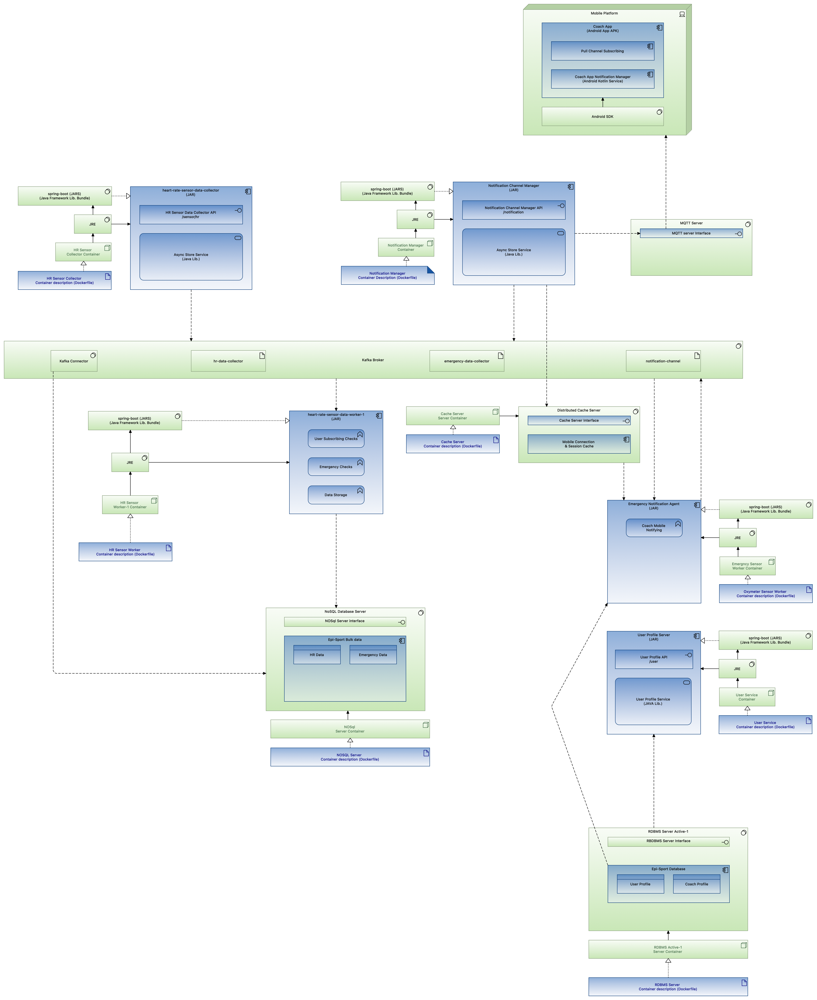

# Projet Sportser, Auteurs : Mehdi KOUMAD, Cédric FAY, Anas Altundag, Yohan BOUALI, Selim Bouhassatine

Projet dans le cadre du cours d'architectures distribuées ING3 

## Version 1

Le project "sport-emergency-notification-agent" permet de récupérer les messages provenant de la queue emergency-data-collector et renvoie des messages dans la queue notification-channel.

Le project "sport-heart-rate-sensor-data-collector" permet de récupérer les messages du mock afin de les insérer directement dans la queue du RabbitMq.

Le project "sport-heart-rate-sensor-data-worker" est le microservice qui permet de récupérer les messages de la queue remplie à l'aide du data-collector. Il fait l'analyse pour savoir si le message est une urgence ou pas.

Le project "sport-notification-channel-manager" est le microservice qui permet de stocker les messages ou d'envoyer les message directement aux mobiles concernés à l'aide de MQTT.

Le project "sport-server-discovery" permet de stocker chaque instance des microservices.

Le project "sport-user-profile-server" est le microservice qui permet de récupérer les informations nécessaires des sportifs de la salle de sport

Le project "sport-zuul-server" est le projet qui sert de reverse proxy.

Le projet "sql" concerne les données de la base de données et le cluster de type actif-passif

Le projet "network-configuration" contient actuellement l'ensemble des règles Iptables sur le firewall permettant d'accéder aux différents services (par exemple: interface web de RabbitMQ ou accès à Gitlab)

Les différentes queues utilisées avec RabbitMq : 
    - emergency-data-collector : contient les emails des sportifs avec une fréquence cardiaque élevé ainsi que cette dernière  
    - hr-data-collector : contient la fréquence cardiaque des sportifs (avec leur email)
    - notification-channel : contient l'association coach-sportif des sportifs qui ont une fréquence cardiaque élevée

Afin de stocker les messages lorsque les coachs ne sont pas connectés, on utilise Redis.
On utilise deux caches, un premier qui permet de stocker les messages remontés par la file "notification-channel" en attente d'être envoyés aux coach concernés et un second cache qui permet de stocker les identifiants des coach actuellement connectés (avec un timeout de 10minutes), les rendant donc éligible à la réception de messages via MQTT.

Norme en matière de messagerie IoT : MQTT. Protocole de communication ayant pour objectif de push les notifications au mobile à l'aide du broker de MQTT

Le project sportser-coach est le projet mobile pour les coachs. Ce projet permet de visualiser les notifications qui arrivent en cas d'urgence. 

## Version 2

Dans cette seconde version, Selim et Yohan ont repris le code de la version 1 et ont enlevé RabbitMQ et pour utiliser Kafka à la place.
Kafka permettant de gérer l'event sourcing, il a été décidé de l'utiliser pour la version 2. On utilisera MongoDB pour stocker les données reçues dans les topics Kafka.

Voici à quoi ressemble l'architecture de la version 2 :




## Lancer le projet

### Prérequis

- Docker
- Docker-compose
- Maven
- Java 8
- Git
- Android Studio

### Lancement

- Cloner le projet
- Se placer dans le dossier racine du projet
- Lancer la commande suivante qui permet de build les projets
    
    ```bash
    mvn clean install -DskipTests
    ```
- Lancer la commande suivante pour créer les images docker
    
    ```bash
    docker build -t server-discovery sportser-server-discovery/.
    docker build -t zuul-server sportser-zuul-server/.
    docker build -t user-profile sportser-user-profile-server/.
    docker build -t data-collector sportser-heart-rate-sensor-data-collector/.
    docker build -t data-worker sportser-heart-rate-sensor-data-worker/.
    docker build -t emergency-agent sportser-emergency-notification-agent/.
    docker build -t notification-manager sportser-notification-channel-manager/.
    docker build -t my-kafka-zookeeper kafka-configuration/.
    ```
- Lancer la commande suivante qui permet de lancer les containers
    
  ```bash
  cd scripts
  docker-compose --file config.yaml up -d
  docker-compose --file startup.yaml up -d
  ```

- Lancer Android Studio et ouvrir le projet sportser-coach
- Lancer le projet sur un émulateur ou un téléphone Android
- Se connecter avec un compte coach
- S'abonner 
- Attendre les notifications